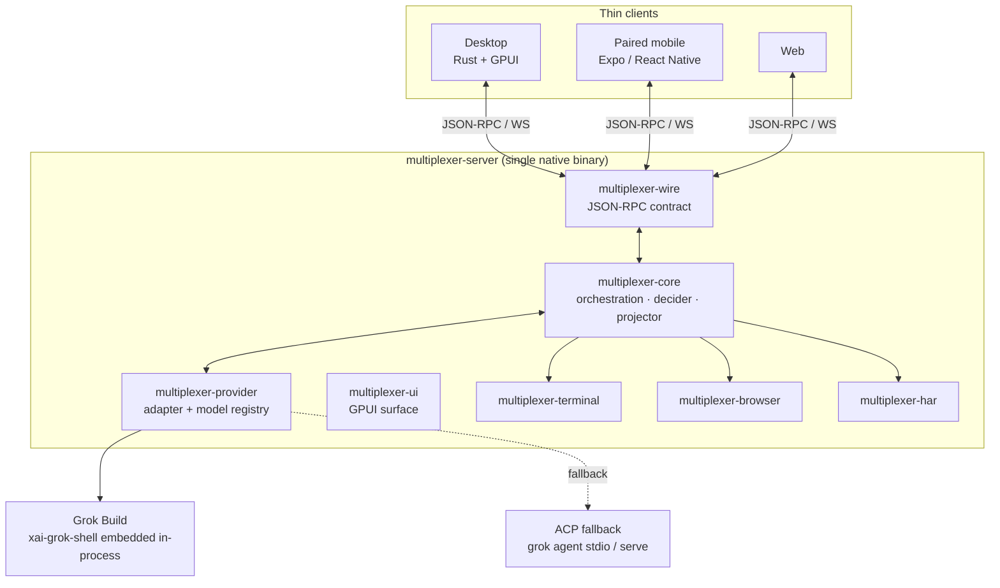
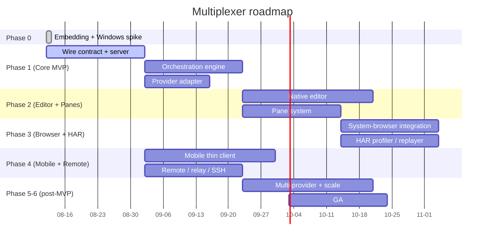

<p align="center">
  
</p>

<p align="center">
  A beautiful, blazing-fast <strong>desktop control surface for your AI coding agents</strong> — a real editor, real performance, and real insight, built in Rust on a GPU-rendered UI.
</p>

<p align="center">
  <a href="https://github.com/PremierStudio/Multiplexer/blob/main/LICENSE"></a>
  <a href="https://github.com/PremierStudio/Multiplexer/actions"></a>
  <a href="https://github.com/PremierStudio/Multiplexer"></a>
  <a href="https://github.com/PremierStudio/Multiplexer"></a>
  <a href="https://www.rust-lang.org"></a>
  <a href="https://github.com/zed-industries/zed/tree/main/crates/gpui"></a>
  <a href="https://github.com/xai-org/grok-build"></a>
  <a href="https://github.com/PremierStudio/Multiplexer/graphs/contributors"></a>
</p>

<p align="center">
  <a href="#thesis">Thesis</a> · <a href="#why">Why</a> · <a href="#architecture">Architecture</a> · <a href="#status">Status</a> · <a href="#engineering">Engineering</a> · <a href="#roadmap">Roadmap</a>
</p>

---

## ✨ Highlights

- **In-process, not a wrapper.** The Grok Build agent runtime is embedded as a library and called directly — no CLI subprocess, no ACP hop. Nobody else does this.
- **A real editor.** A native, GPU-rendered editor with inline diff-apply, LSP, multi-cursor, and Vim mode as the trust/context mechanism for the agent loop.
- **Your browsers, not a bundled one.** Detect and import the browsers you already have, drive them over CDP. No bundled Chromium.
- **Ships with a HAR profiler/replayer.** Capture the network, visualize waterfalls, replay sessions, and feed the insight back to the agent.
- **Panes that pop out.** Chat, build, and an instrumentation bar that can each float to their own window.
- **Strict TDD at 100/100.** Every module lands at 100% coverage _and_ 100% mutation score with zero survivors, enforced by CI. Today that gate is proven on `multiplexer-wire`; every future module must clear it too.

---

<a id="thesis"></a>

## The thesis

Most agent tools treat the agent as a black box you talk to through a chat bubble. You watch text stream by and hope. Multiplexer's core idea is different: **the agent is an instrument you hold, not a service you message.**

By embedding the agent runtime in the same process, we get the runtime's internals — not just its stdout. By pairing that with a real editor, real performance, and real network insight, we turn the agent loop from something you observe into something you **steer with confidence**. A control surface, not a chat client.

---

<a id="why"></a>

## Why Multiplexer?

Because the two strongest competitors are locked out of where we're going:

- **Superset and Conductor are macOS-only.** Multiplexer is cross-platform, Windows-first in practice.
- **Orca and T3 Code drive agents as external processes.** In-process embedding gives us lower latency, richer introspection, and HAR/orchestration that a process boundary can't.

| | Multiplexer | Orca | T3 Code | Superset | Conductor |
|---|---|---|---|---|---|
| In-process agent runtime | ✅ | ❌ | ❌ | ❌ | ❌ |
| Native editor | ✅ | ❌ | ❌ | ❌ | ❌ |
| System-browser import (no bundled Chromium) | ✅ | ❌ | ❌ | ❌ | ❌ |
| HAR profiler / replayer | ✅ | ❌ | ❌ | ❌ | ❌ |
| Windows-first | ✅ | partial | ✅ | ❌ | ❌ |
| Mutation tested at 100/100 | ✅ | ❌ | ❌ | ❌ | ❌ |

---

<a id="architecture"></a>

## Architecture

The center of gravity is a **single native Rust binary** that owns the agent runtime, terminals, git, filesystem, checkpoints, and HAR capture. Desktop, mobile, and web are thin shells over one authenticated **JSON-RPC-over-WebSocket** contract.



The wire contract is the single source of truth — `multiplexer-wire` is *planned* to be codegen'd for Swift, Kotlin, and TypeScript clients, so the desktop, mobile, and web clients can never drift apart.

---

<a id="status"></a>

## Status

**The Phase-0 spike is complete and green.** The core go/no-go that gated the whole product — *can we embed `xai-grok-shell` as a library and build it on Windows?* — is **proven**: the Phase 0 spike built the vendored runtime on Windows and consumed it from an independent binary, loading the real user config. See [`docs/SPIKE-REPORT.md`](docs/SPIKE-REPORT.md). The rest of Phase 0 (GPUI shell, wire skeleton, test harness, CI gates) is still in progress per [`plan/19-roadmap-and-milestones.md`](plan/19-roadmap-and-milestones.md).

The full implementation plan lives in [`plan/`](plan/) (21 authored docs, adversarially reviewed) with 40 locked decisions in [`docs/DECISIONS.md`](docs/DECISIONS.md).

What exists today:

- ✅ Vendored `xai-org/grok-build` fork under `third_party/`, building on Windows
- ✅ Phase-0 spike proving in-process consumption (`spike/`)
- ✅ `multiplexer-wire` with the approval-decision model, TDD at 100/100
- 🔲 Everything else — the editor, orchestration, terminal, browser, HAR, panes, mobile, remote

This is a real, working product in the making, not a mockup. The next milestone is the live in-process turn.

---

<a id="engineering"></a>

## Engineering: strict TDD with a 100/100 gate

Every module is written test-first (RED → GREEN → refactor) and must clear a hard, CI-enforced gate before it is committed:

```text
fmt → clippy (deny warnings) → unit + property → mutation → integration → component → e2e → coverage → perf
```

- **100% coverage** (lines/branches/functions/regions) via `cargo-llvm-cov`.
- **100% mutation score** via `cargo-mutants`, with **zero survivors**. Coverage alone is a lie; mutation testing proves the tests actually catch real faults. A surviving mutant is fixed by strengthening the test, never by silencing it.
- **Property-based testing** with `proptest` for state machines, deciders, projectors, and serializers — so we catch whole classes of bugs, not single instances.
- **Deep assertions, not shallow ones.** We assert on the projected read model and the event stream, not on the return value of the triggering call. Tests prove invariants, round-trip identity, and cross-layer consistency.
- **Mutation gates every subsystem**, including the editor's buffer and diff-apply, the terminal's PTY and scrollback, the browser's security controls, and the pane system's layout engine.
- **A dedicated performance stage** enforces the hard gates: cold start `< 300ms`, input latency `< 16ms` (p95), dozens of concurrent subagents without a serialization bottleneck.
- **E2E on the merge gate, full suite nightly.** No "skip e2e for small changes" path.

The full testing strategy is in [`plan/15-testing-strategy.md`](plan/15-testing-strategy.md).

---

## Repository layout

```text
crates/
  multiplexer-wire/       shared JSON-RPC contract (single source of truth, codegen for clients)  [exists]
  multiplexer-provider/   provider adapter trait + model registry (Grok in-process + ACP)          [planned]
  multiplexer-core/       orchestration engine, decider, projector, read model                      [planned]
  multiplexer-server/     composition root: the single native binary                               [planned]
  multiplexer-ui/         GPUI desktop UI (editor, panes)                                          [planned]
  multiplexer-terminal/   embedded terminal                                                        [planned]
  multiplexer-browser/    system-browser import + CDP                                              [planned]
  multiplexer-har/        HAR profiler / replayer                                                  [planned]
third_party/
  grok-build/             vendored fork (SOURCE_REV tracked, Windows build supported)
spike/                    Phase-0 spike: in-process consumption proof
docs/
  DECISIONS.md            D1-D40 locked decisions (authoritative)
  PLAN-CONTEXT.md         shared plan context
  SPIKE-REPORT.md         the Phase-0 GO verdict
  REVIEW-SUMMARY.md       adversarial review findings
plan/                     00-20 implementation plan docs
```

---

<a id="roadmap"></a>

## Roadmap



The MVP is **Phases 1–4** (core runtime + editor/panes + browser/HAR + mobile/remote). The paired mobile app is a hard MVP gate. Matching the full Orca baseline across **Phases 1–5** is roughly **~6–9 months with 3–5 engineers** (≈ 20–40 person-months). See [`plan/19-roadmap-and-milestones.md`](plan/19-roadmap-and-milestones.md).

---

## Contributing

This repo follows the rules in [`AGENTS.md`](AGENTS.md) (binding for every agent) and the plan in [`plan/`](plan/). The short version:

- **Strict TDD.** Write the failing test first (RED), confirm it fails for the right reason, then implement (GREEN), then refactor.
- **The 100/100 gate.** No module merges unless it's at 100% coverage _and_ 100% mutation score, with fmt/clippy clean.
- **No survivor silencing.** A surviving mutant is fixed by strengthening the test, never by weakening the code or adding ignore comments.
- **Deep assertions.** Assert on the read model and event stream, not on return values.

---

## License

Apache License 2.0 © [Premier Studio](https://github.com/PremierStudio). See [LICENSE](LICENSE).

Multiplexer embeds a vendored fork of [`xai-org/grok-build`](https://github.com/xai-org/grok-build) (Apache-2.0). See the fork's `THIRD-PARTY-NOTICES` and the in-tree notices for third-party code.